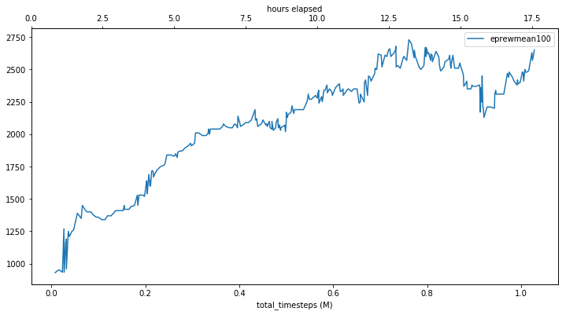

# retro-baselines-rudder

Applying the [RUDDER paper (arxiv.org/abs/1806.07857)](https://arxiv.org/abs/1806.07857) to Sonic.

This code is [retro-baselines](https://github.com/openai/retro-baselines) modified to use the baselines_rudder code.

Some of the requirements needed are listed in the included requirements.txt file. Install with `pip install -r requirements.txt`.

